# Arquitetura — Pipeline de Pagamentos (CDC → Flink → Alerta de Fraude)

> Leia este documento **antes** do README. Ele explica *o que* o pipeline faz
> e *por quê*. O README explica *como subir e provar* que roda.

## Visão geral

O dado nasce no Postgres, entra no Confluent Cloud por CDC (Change Data
Capture), é enriquecido e avaliado no Flink SQL, e um alerta de fraude é
emitido quando uma regra dispara. Dois ramos de IA são opcionais e **plugáveis**
— não são dependência da entrega base.

```mermaid
flowchart LR
    subgraph L1["1 · Fundação"]
        PG[(Postgres<br/>dados sintéticos)]
        SA_W([SA cdc-writer<br/>escrita])
        SA_R([SA app-reader<br/>leitura])
    end

    subgraph L2["2 · Contrato"]
        SR[Schema Registry<br/>compat. BACKWARD]
    end

    subgraph L3["3 · Ingestão (CDC)"]
        CDC[Conector Debezium<br/>lê WAL: insert/update/delete]
        T1[["tópico: transacoes"]]
        T2[["tópico: contas"]]
        DLQ[["DLQ: eventos com defeito"]]
    end

    subgraph L4["4 · Processamento · Flink SQL"]
        ENR[Enriquecer<br/>transacao &#8904; conta]
        R1{Regra 1<br/>3 tx / mesmo cartão / 60s}
        ALERT[["tópico: alertas-fraude"]]
    end

    subgraph L5["5 · Operação"]
        OBS[Métricas · ACLs · Custo]
    end

    PG -->|CDC via pgoutput| CDC
    SA_W -. autentica .-> CDC
    CDC --> T1 & T2
    CDC -. falha de serializacao .-> DLQ
    CDC <-.->|registra/valida schema| SR

    T1 & T2 --> ENR
    SA_R -. autentica .-> ENR
    ENR --> R1
    R1 -->|dispara| ALERT

    L1 & L2 & L3 & L4 --> OBS

    %% ===== Ramo IA A: scoring em tempo real (caminho quente) =====
    subgraph AI_A["IA · Scoring em tempo real (busca vetorial)"]
        EMB[Embedding das features<br/>da transacao]
        VDB[(Vector DB<br/>fraudes historicas)]
        SCORE[score de risco]
    end
    ENR --> EMB --> VDB --> SCORE --> R1

    %% ===== Ramo IA B: RAG na investigação (caminho frio) =====
    subgraph AI_B["IA · RAG na investigacao do alerta"]
        AGENT[Agente RAG]
        VDB2[(Vector DB<br/>casos · normas · historico)]
        EXPL[Explicacao +<br/>recomendacao ao analista]
    end
    ALERT --> AGENT
    AGENT <-->|recupera contexto| VDB2
    AGENT --> EXPL

    classDef hot fill:#ffe8e8,stroke:#d33;
    classDef cold fill:#e8f0ff,stroke:#36c;
    class AI_A hot
    class AI_B cold
```

**Vermelho (quente):** dentro do stream, latência baixa — só similaridade
vetorial, **não é RAG**. **Azul (frio):** fora do caminho quente, disparado pelo
alerta — aqui sim RAG completo.

## O caminho do dado, etapa por etapa

1. **Postgres** grava transações e contas. O conector não lê as tabelas: lê o
   **WAL** (write-ahead log), onde cada `insert/update/delete` já está registrado.
2. **CDC (Debezium)** transforma cada mudança do WAL em um **evento Kafka** e o
   publica em um tópico (`transacoes`, `contas`).
3. **Schema Registry** guarda o contrato (formato) das mensagens e **rejeita**
   mudanças incompatíveis antes que elas quebrem os consumidores.
4. **Flink SQL** junta (`JOIN`) a transação com os dados da conta e aplica a
   **regra de fraude**. O resultado vai para `alertas-fraude`.
5. **Operação** observa métricas, acessos (ACLs) e custo.

## Por que cada peça

| Peça | Por que esta, e não outra |
|---|---|
| **CDC (Debezium/pgoutput)** | Captura mudança sem poluir a aplicação nem fazer *polling* na tabela. O `pgoutput` é o plugin nativo do Postgres — nada extra para instalar no banco. |
| **Confluent Cloud (Basic)** | Kafka gerenciado; o tier Basic é o mais barato para aprender. Tira do escopo operar broker/ZooKeeper na mão. |
| **Schema Registry (BACKWARD)** | Compatibilidade *backward* deixa o produtor evoluir o schema sem quebrar quem já consome. É o teste pedido na Camada 2. |
| **Flink SQL** | Junção e janela temporal (60s) são declarativas em SQL. Menos código imperativo, menos bug de estado. |
| **Duas identidades (writer/reader)** | *Least privilege*: quem ingere não precisa ler alertas; quem processa não precisa escrever CDC. Reduz raio de dano de uma chave vazada. |
| **DLQ (dead-letter queue)** | Evento com defeito vai para uma fila separada em vez de **parar o conector**. Pipeline continua; o problema fica isolado para análise. |

## Invariantes (o que nunca pode quebrar)

- Toda tabela capturada tem **chave primária** e `REPLICA IDENTITY FULL`
  (senão `update`/`delete` chegam sem a imagem antiga da linha).
- Nenhuma senha/chave é versionada — só `.env.example`.
- Produtor e consumidor usam **chaves de API distintas**.
- Mudança de schema passa pelo teste de compatibilidade antes de ir para produção.

## Ramos de IA (opcionais)

- **A · Scoring em tempo real** — gera *embedding* das features da transação e
  busca o vizinho mais próximo no Vector DB de fraudes históricas. Retorna um
  score de baixa latência que alimenta a regra. É **busca vetorial**, não RAG.
- **B · RAG na investigação** — quando o alerta dispara, um agente recupera
  contexto no Vector DB (casos passados, normas, histórico da conta) e gera a
  explicação/recomendação ao analista. Roda **fora** do caminho quente, então
  não trava o pipeline.

> Ordem recomendada: entregar e provar as 5 camadas primeiro; só então acoplar
> os ramos de IA via o tópico `alertas-fraude`.
